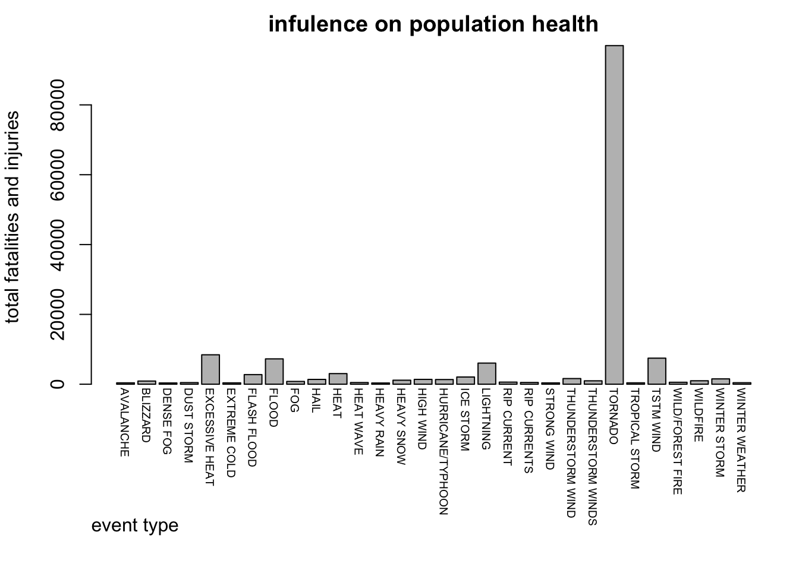
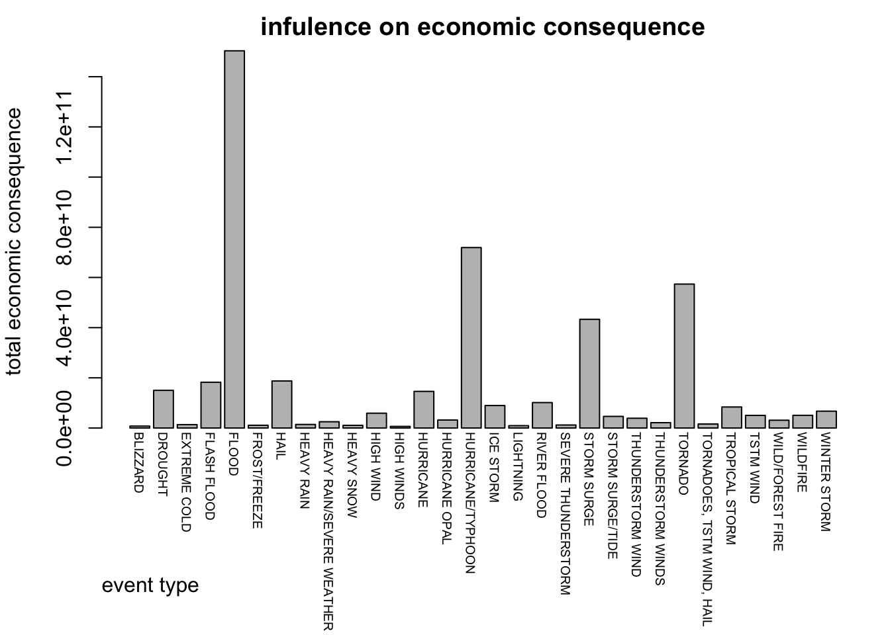

Severe weather events can result a lot of problems on public health and econoic. In this document, we will discuss the weather events influence on health and economic. We will mainly discuss the following two questions across the United States.  
1. Which type of events are most harmful with respect to population health?  
2. Which type of events have the greatest economic consequences?

### Data
In this document, we will use data from the U.S. National Oceanic and Atmospheric Administration's (NOAA) storm database. The definition of some of the variables can be found on National Weather Service [Storm Data Document](https://d396qusza40orc.cloudfront.net/repdata%2Fpeer2_doc%2Fpd01016005curr.pdf). Additionally, Codebook can be seen from [IRE website](http://ire.org/nicar/database-library/databases/storm-events/).


### Data Processing
First, load the CSV file containing the data. (Assume that the zip file has been downloaded.)

```r
data <- read.csv(bzfile("repdata-data-StormData.csv.bz2"), stringsAsFactors=FALSE)
```
Then let's discuss the following 2 questions.  
__1. Across the United States, which type of events are most harmful with respect to population health?__  
The type of events is indicated in the __EVTYPE__ variable. And we also know the influence on population health is indicated in __FATALITIES__ and __INJURIES__.  


```r
# Subset these columns to do the data processing.  
health <- subset(data, select = c("EVTYPE", "FATALITIES", "INJURIES"))
# delete rows that both FATALITIES and INJURIES are 0
health <- health[!(health$FATALITIES == 0 & health$INJURIES == 0), ]
# add both fatalities and injuries to do the calculation, for higher numbers are more harmful to population health in total.
health$HEALTHHARM <- health$FATALITIES + health$INJURIES 
# see the data structure of health
str(health) 
```

```
## 'data.frame':	21929 obs. of  4 variables:
##  $ EVTYPE    : chr  "TORNADO" "TORNADO" "TORNADO" "TORNADO" ...
##  $ FATALITIES: num  0 0 0 0 0 0 1 0 0 1 ...
##  $ INJURIES  : num  15 2 2 2 6 1 14 3 3 26 ...
##  $ HEALTHHARM: num  15 2 2 2 6 1 15 3 3 27 ...
```

```r
# see how many types of events remained in the dataset
nlevels(as.factor(health$EVTYPE)) 
```

```
## [1] 220
```
220 types of events remained in the dataset, while there are only 48 types defined in the Storm Data Document.   

```r
# group HEALTHHARM by EVTYPE, apply the sum function, then sort by their effect.
s <- sort(tapply(health$HEALTHHARM, health$EVTYPE, sum), decreasing = TRUE) 
# try to see the ratio of the top 30 types 
sum(s[1:30])/sum(s)
```

```
## [1] 0.9725
```
From above, we can see the top 30 types of events has already covered over 97% of all effect on population health. So instead of classify all the types in the `health` dataset, I decided to ignore the last 3%. Because it should not impact the final result.  

```r
top30.health <- subset(health, health$EVTYPE %in% names(s)[1:30])
sum.top30.health <- aggregate(top30.health$HEALTHHARM ~ top30.health$EVTYPE, FUN = "sum")
colnames(sum.top30.health) <- c("EVTYPE", "HEALTHHARM")
with(sum.top30.health, {
    par(mar = c(8, 4, 2, 1))
    bp <- barplot(HEALTHHARM, main = "infulence on population health", xlab = "", ylab = "total fatalities and injuries")
    text(x = bp-.75, par("usr")[3], labels = EVTYPE, srt = -90, cex = .6, pos = 4, xpd = TRUE)
    mtext("event type", side = 1, line = 5.5, adj = 0)
})
```

 

As you can see above, we plot a barplot to describe the influence of top 30 type events on population health. we can see clearly that `TORNADO` is definitely the __most__ harmful events with respect to population health.  


__2. Across the United States, which type of events have the greatest economic consequences?__  
First we find out that influence on economic consequences is indicated in __PROPDMG__ and __CROPDMG__, besides, there are exponent on each of these two variables. So just like we did in question 1, subset these columns.  

```r
econo <- subset(data, select = c("EVTYPE", "PROPDMG", "PROPDMGEXP", "CROPDMG", "CROPDMGEXP"))
# delete rows that both PROPDMG and CROPDMG are 0
econo <- econo[!(econo$PROPDMG == 0 & econo$CROPDMG == 0), ]
# see the data structure of health
str(econo)
```

```
## 'data.frame':	245031 obs. of  5 variables:
##  $ EVTYPE    : chr  "TORNADO" "TORNADO" "TORNADO" "TORNADO" ...
##  $ PROPDMG   : num  25 2.5 25 2.5 2.5 2.5 2.5 2.5 25 25 ...
##  $ PROPDMGEXP: chr  "K" "K" "K" "K" ...
##  $ CROPDMG   : num  0 0 0 0 0 0 0 0 0 0 ...
##  $ CROPDMGEXP: chr  "" "" "" "" ...
```

```r
# see levels of PROPDMGEXP and CROPDMGEXP
names(summary(as.factor(econo$PROPDMGEXP)))
```

```
##  [1] ""  "-" "+" "0" "2" "3" "4" "5" "6" "7" "B" "h" "H" "K" "m" "M"
```

```r
names(summary(as.factor(econo$CROPDMGEXP)))
```

```
## [1] ""  "?" "0" "B" "k" "K" "m" "M"
```
We find out that H is Hundred, K is Thousand, M is Million, and B is Billion from Codebook. So transfer these alphabets to numbers, and change "", "-", "?", "+" to 0. Then combine the values.

```r
pattern <- c("^$|[-?+]", "[hH]", "[kK]", "[mM]", "[bB]")
replacement <- c(0, 2, 3, 6, 9)
for (i in 1:5) {
  econo$PROPDMGEXP <- sub(pattern[i], replacement[i], econo$PROPDMGEXP)
  econo$CROPDMGEXP <- sub(pattern[i], replacement[i], econo$CROPDMGEXP)
}
# combine PROPDMG and PROPDMGEXP, CROPDMG and CROPDMGEXP.
econo$PROPDMGCASH <- econo$PROPDMG * 10 ^ as.numeric(econo$PROPDMGEXP)
econo$CROPDMGCASH <- econo$CROPDMG * 10 ^ as.numeric(econo$CROPDMGEXP)
# add PROPDMGCASH and CROPDMGCASH to do the calculation.
econo$DMGCASH <- econo$PROPDMGCASH + econo$CROPDMGCASH
```

```r
# group DMGCASH by EVTYPE, apply the sum function, then sort by their effect.
se <- sort(tapply(econo$DMGCASH, econo$EVTYPE, sum), decreasing = TRUE) 
# try to see the ratio of the top 30 types 
sum(se[1:30])/sum(se)
```

```
## [1] 0.9833
```
From the result above, we can see the top 30 types of events has already covered over 98% of all econimic consequence. Same as question 1, instead of classify all the types in the `econo` dataset, I decided to ignore the last 2%. Because it should not impact the final result.

```r
top30.econo <- subset(econo, econo$EVTYPE %in% names(se)[1:30])
sum.top30.econo <- aggregate(top30.econo$DMGCASH ~ top30.econo$EVTYPE, FUN = "sum")
colnames(sum.top30.econo) <- c("EVTYPE", "DMGCASH")
with(sum.top30.econo, {
    par(mar = c(8, 4, 2, 1))
    bp <- barplot(DMGCASH, main = "infulence on economic consequence", xlab = "", ylab = "total economic consequence")
    text(x = bp-.75, par("usr")[3], labels = EVTYPE, srt = -90, cex = .6, pos = 4, xpd = TRUE)
    mtext("event type", side = 1, line = 5.5, adj = 0)
})
```

 

As you can see above, we plot a barplot to describe the influence of top 30 type events on economic damage. We can clearly see that `FLOOD` definitely has the __greatest__ economic consequences.

### Results
As we discussed in the before section, we came to a conclution that  
`TORNADO` is the __most__ harmful events with respect to population health.  
`FLOOD` has the __greatest__ economic consequences.
